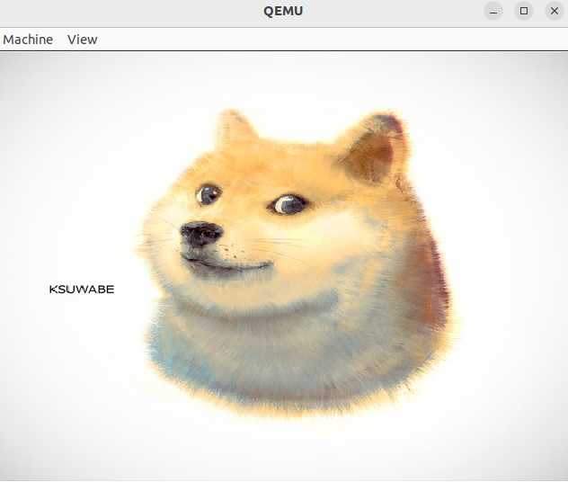

# OS-lab
## introduction
This is a repository containing what I have learned in NJU-os.It encompasses a range of issues that I encountered throughout the course, as well as various tools that I have developed.
## Labs
### L0
In this Lab , I have developed a tool aimed at helping us transform a colorful image to a const C array . The resulting array can be utilized to render a widget to show the respective image. 
The output of this project is as follows:

<div align=center>

</div>

you can run the following command to generate a c array of your image
```
python3 ImageTransform.py {your image file path} -o out_path
```
### M1 pstree
In this laboratory exercise, I have implemented the [pstree.c](./M1/pstree.c), which is a program capable of displaying the user's running processes in a tree-like structure. The program offers several command-line arguments to customize the output:
```
         -p         show pids,PIDS are shown as decimal numbers.
         -t         hidden threads and only show the processes.
         -n         sort processes with the same parent by PID.
for example:
        ./pstree-64 [-p] [-n] [-t]
```
you can also add pid to the end of the command , to only display the sub-tree with a specific root process whose pid is at the end of the command.
```
        ./pstree-64 [-p] [-t] [-n] pid 
```


